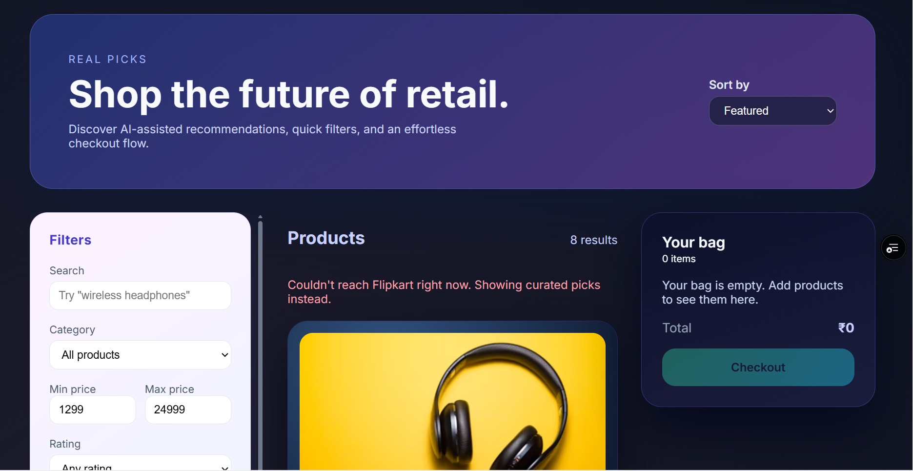

# Ecommerce AI - Multi-Source Shopping Assistant

A modern e-commerce application that aggregates real-time product data from **Flipkart** and **Amazon** using RapidAPI. It features an **AI Stylist** powered by Google Gemini to provide personalized shopping recommendations.



## 🚀 Features

- **Multi-Source Aggregation**: Fetches products from both Flipkart and Amazon simultaneously.
- **AI Shopping Assistant**: "AI Stylist" powered by Gemini API helps users find products based on natural language queries.
- **Real-time Currency Conversion**: Automatically converts Amazon prices (USD) to INR.
- **Smart UI**:
    - **Source Badges**: Distinct badges for Flipkart (Orange) and Amazon (Blue) products.
    - **Modal Descriptions**: Clean, centered modal dialogs for product details.
    - **Pagination**: "Load More" functionality to browse endless products.
- **Responsive Design**: Fully responsive grid layout with glassmorphism effects.

## 🛠️ Tech Stack

- **Frontend**: React, CSS Modules, Context API
- **Backend**: Node.js, Express
- **APIs**: RapidAPI (Real-time Amazon Data, Flipkart Scraper), Google Gemini AI
- **Deployment**: Vercel (Serverless)

## 📋 Prerequisites

- Node.js 18+
- [RapidAPI Account](https://rapidapi.com/) (Subscribe to "Real-time Amazon Data" and "Flipkart Scraper")
- [Google Gemini API Key](https://ai.google.dev/)

## ⚙️ Local Setup

### 1. Backend Setup

The backend acts as a proxy to hide API keys and handle data normalization.

1.  Navigate to the backend directory:
    ```bash
    cd backend
    ```
2.  Install dependencies:
    ```bash
    npm install
    ```
3.  Create a `.env` file based on `env.example` (or use the keys below):
    ```env
    PORT=4000
    CORS_ORIGINS=http://localhost:3000
    
    # RapidAPI Configuration
    RAPIDAPI_KEY=your_rapidapi_key
    
    # Flipkart API
    FLIPKART_RAPIDAPI_HOST=flipkart-scraper-api.p.rapidapi.com
    FLIPKART_RAPIDAPI_BASE_URL=https://flipkart-scraper-api.p.rapidapi.com/products/search
    
    # Amazon API
    AMAZON_RAPIDAPI_HOST=realtime-amazon-data.p.rapidapi.com
    AMAZON_RAPIDAPI_BASE_URL=https://realtime-amazon-data.p.rapidapi.com/product-search
    ```
4.  Start the server:
    ```bash
    npm run dev
    ```

### 2. Frontend Setup

1.  Navigate to the project root:
    ```bash
    cd ..
    ```
2.  Install dependencies:
    ```bash
    npm install
    ```
3.  Create a `.env` file in the root:
    ```env
    REACT_APP_API_BASE=http://localhost:4000
    REACT_APP_AI_KEY=your_gemini_api_key
    ```
4.  Start the React app:
    ```bash
    npm start
    ```
5.  Open [http://localhost:3000](http://localhost:3000) to view the app.

## ☁️ Deployment (Vercel)

This project is configured for easy deployment on Vercel.

### Backend Deployment
1.  Push your code to GitHub.
2.  Import the project in Vercel.
3.  Select **Root Directory** as `backend`.
4.  Add Environment Variables (`RAPIDAPI_KEY`, etc.) from your backend `.env`.
5.  Deploy.

### Frontend Deployment
1.  Import the project in Vercel (create a **new** project).
2.  Leave **Root Directory** as `./`.
3.  Add Environment Variables:
    - `REACT_APP_API_BASE`: Your deployed backend URL (e.g., `https://your-backend.vercel.app`)
    - `REACT_APP_AI_KEY`: Your Gemini API Key
4.  Deploy.

## 📂 Project Structure

```
.
├── backend/                # Node.js/Express Backend
│   ├── api/                # Vercel Serverless Entry Point
│   ├── src/
│   │   ├── routes/         # API Routes
│   │   ├── amazonClient.js # Amazon API Logic
│   │   ├── flipkartClient.js # Flipkart API Logic
│   │   └── app.js          # Express App Setup
│   └── vercel.json         # Backend Vercel Config
├── src/                    # React Frontend
│   ├── components/         # UI Components (ProductCard, Home, etc.)
│   ├── hooks/              # Custom Hooks (useFlipkartProducts)
│   └── styles/             # CSS Styles
├── public/                 # Static Assets
├── vercel.json             # Frontend Vercel Config
└── README.md               # Documentation
```

## 🤝 Contributing

Contributions are welcome! Please open an issue or submit a pull request.

## 📄 License

MIT
